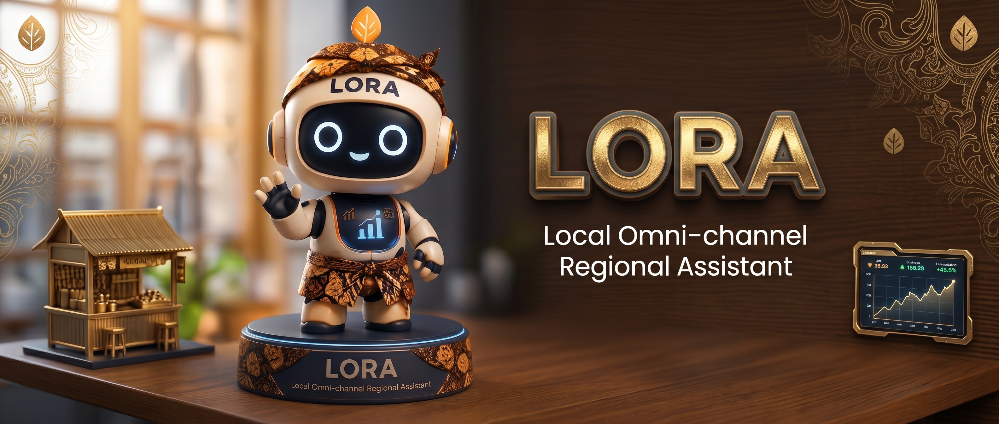

# 🚀 LORA (Local Omni-channel Regional Assistant)

<div align="center">



### **AI Business Intelligence & Smart Regional Marketplace for Local SMEs**  
*Solusi Terpadu Digitalisasi, Peramalan Permintaan AI, Segmentasi Pelanggan, dan Akselerasi Ekonomi Kreatif UMKM di Daerah Istimewa Yogyakarta & Jawa Tengah.*

<br/>

[](https://nextjs.org/) [](https://react.dev/) [](https://www.typescriptlang.org/) [](https://tailwindcss.com/) [](https://supabase.com/) [](https://ai.google.dev/) [](https://cloudinary.com/)

</div>

---

## 📌 Daftar Isi
- [Tentang LORA](#-tentang-lora)
- [Pilar Solusi & Nilai Tambah](#-pilar-solusi--nilai-tambah)
- [Fitur Utama Aplikasi](#-fitur-utama-aplikasi)
- [Arsitektur & Tech Stack](#-arsitektur--tech-stack)
- [Struktur Folder Proyek](#-struktur-folder-proyek)
- [Panduan Instalasi & Menjalankan Lokal](#-panduan-instalasi--menjalankan-lokal)
- [Akun Demo Pengujian](#-akun-demo-pengujian)
- [Dokumentasi Spec-Driven Development](#-dokumentasi-spec-driven-development)
- [Lisensi & Kontribusi](#-lisensi--kontribusi)

---

## 📖 Tentang LORA

**LORA (*Local Omni-channel Regional Assistant*)** adalah platform web terpadu (*PWA-ready*) yang menggabungkan kekuatan **Regional E-Commerce Marketplace** dengan **Asisten Bisnis Cerdas Berbasis AI**. LORA dirancang spesifik untuk menjawab tantangan operasional dan pemasaran pelaku UMKM di sektor Batik, Kuliner Lokal, Kerajinan Tangan, Oleh-Oleh Khas Daerah, serta Desa Wisata di wilayah **Daerah Istimewa Yogyakarta dan Jawa Tengah**.

### 💥 Permasalahan yang Dihadapi UMKM:
1. **Fluktuasi Stok saat Musim/Event Daerah**: Sering terjadi kehabisan stok (*stockout*) saat event budaya lokal ramai, atau sebaliknya penumpukan barang (*overstock*) karena tidak ada proyeksi penjualan berbasis data.
2. **Ketiadaan Segmentasi Pelanggan**: Promosi dilakukan secara massal tanpa mengetahui pelanggan loyal, pelanggan baru, atau pelanggan yang hampir hilang (*churn*).
3. **Akses Konsultasi Bisnis yang Terbatas**: Biaya mahal untuk menyewa konsultan bisnis profesional dalam merumuskan strategi promosi, deskripsi produk, maupun analisis margin laba.
4. **Hambatan Transaksi Formal**: Kebutuhan alur belanja yang fleksibel yang mendukung integrasi pembayaran QRIS dinamis maupun checkout langsung ke WhatsApp penjual.

---

## 🎯 Pilar Solusi & Nilai Tambah

```
                      ┌─────────────────────────────────────────┐
                      │                LORA PLATFORM            │
                      └────────────────────┬────────────────────┘
                                           │
         ┌───────────────────┬─────────────┴───────┬───────────────────┐
         ▼                   ▼                     ▼                   ▼
┌─────────────────┐ ┌─────────────────┐ ┌─────────────────┐ ┌─────────────────┐
│ Smart Regional  │ │ Hybrid AI Sales │ │ RFM Customer    │ │ Contextual AI   │
│   Marketplace   │ │ Forecast Engine │ │  Segmentation   │ │   Consultant    │
│  (Dual-Role)    │ │ (WAPE + Events) │ │ (Direct WA+CRM) │ │ (Gemini LLM)    │
└─────────────────┘ └─────────────────┘ └─────────────────┘ └─────────────────┘
```

1. **Dual-Role Regional Marketplace**: Pengguna dapat menjadi Pembeli sekaligus mengaktifkan Toko UMKM dalam satu akun terpadu.
2. **Hybrid Demand Forecasting**: Memprediksi kebutuhan stok masa depan dengan memadukan data historis dan kalender lonjakan agenda wisata/budaya regional.
3. **Actionable RFM Segmentation**: Mengelompokkan pelanggan ke dalam 5 kuadran aksi dan menyediakan generator voucher tertarget serta integrasi WhatsApp promosi.
4. **Conversational BI**: Konsultan AI interaktif yang membaca konteks langsung transaksi toko Anda untuk memberikan strategi bisnis relevan.

---

## ✨ Fitur Utama Aplikasi

### 1. 🛍️ Smart Storefront & Regional Marketplace
* **Katalog Berbasis Wilayah**: Filter produk instan berdasarkan Kabupaten/Kota (Bantul, Sleman, Yogyakarta, Surakarta, Pekalongan, Semarang, dll.) dan kategori produk.
* **Single-Row Category Carousel**: Slider kategori horizontal modern dengan tombol navigasi melayang (*floating buttons*) dan efek gradien tepi.
* **Etalase Toko Digital (`/toko/[slug]`)**: Halaman profil toko mandiri dengan link unik, informasi jam buka, alamat, status verifikasi, dan etalase produk berpaging (12 item/halaman).
* **In-App Checkout & Kalkulasi Kupon**: Checkout belanja dengan validasi kode voucher diskon secara *real-time*.
* **WhatsApp Order Dispatch**: Menghasilkan draf pesanan dan invoice terstruktur yang langsung terhubung ke WhatsApp penjual.

### 2. 📈 Hybrid AI Sales & Demand Forecast Engine (`/dashboard/forecast`)
* **Continuous Curve Visualization**: Garis data histori (*Solid Slate-800*) menyambung langsung tanpa jeda ke garis proyeksi oranye (*Dashed Terracotta #D97706*) dan dilengkapi *Confidence Interval Band*.
* **Proporsional Horizon Multi-Jangka**:
  * **Horizon 7 Hari**: Menampilkan 14 hari histori + 7 hari proyeksi.
  * **Horizon 15 Hari**: Menampilkan 30 hari histori + 15 hari proyeksi.
* **Metrik Evaluasi WAPE (*Weighted Absolute Percentage Error*)**: Tahan terhadap penjualan bernilai Rp 0 pada ritel intermittent sehingga sumbu Y terskala proporsional (Rp 0 s.d. Rp 3–5 Juta) tanpa lonjakan angka semu.
* **Rekomendasi Restok Produk Harian**: AI menghitung kebutuhan restok per item produk untuk memitigasi risiko *out-of-stock*.

### 3. 🎯 Customer Insights & RFM Segmentation (`/dashboard/customers`)
* **Segmentasi Otomatis 5 Kuadran**:
  * 🏆 **Champions**: Pelanggan terbaik berbelanja rutin dengan nilai transaksi tertinggi.
  * 💙 **Loyal Customers**: Pelanggan setia yang responsif terhadap penawaran toko.
  * ✨ **Potential Loyalists**: Pembeli baru berpotensi tinggi menjadi pelanggan tetap.
  * ⚠️ **At Risk**: Pelanggan lama yang berisiko beralih (*churn*).
  * 💤 **Hibernating**: Pelanggan inaktif yang membutuhkan penawaran *win-back*.
* **Direct WhatsApp Campaigner**: Membuka draf pesan personalisasi sapaan dan penawaran ke nomor WhatsApp pelanggan dengan 1 klik.
* **Generator Kupon Toko Tertarget**: Pembuatan kode voucher promo khusus (persentase / potongan tetap) per segmen pelanggan dengan batas pemakaian dan masa berlaku.
* **Ekspor Kontak CSV**: Unduh data kontak pelanggan tersegmentasi untuk keperluan promosi eksternal.

### 4. 🤖 AI Business Consultant (`/dashboard/ai-consultant`)
* **Konsultan AI Kontekstual**: Didukung oleh Google Gemini AI 2.0 yang menganalisis langsung rekap penjualan 30 hari terakhir, performa produk, dan kategori toko.
* **Analisis & Rekomendasi Multidimensi**:
  * Strategi penetapan harga (*dynamic pricing*) dan *bundling*.
  * Optimasi judul dan deskripsi produk ramah SEO.
  * Rekomendasi promosi menyambut event musiman regional.

### 5. 📅 Kalender Event & Tren Budaya Regional (`/dashboard/events`)
* **Agenda Budaya & Pariwisata DIY-Jateng**: Informasi festival lokal (Sekaten, Festival Payung, Grebeg Mulud, Dieng Culture Festival, Pekalongan Batik Week).
* **Estimasi Lonjakan Pengunjung**: Indikator persentase potensi lonjakan permintaan (+20% s.d. +50%) sebagai panduan penjual menyiapkan bahan baku.
* **Paginasi Grid Interaktif**: Tampilan 6 event/halaman dengan filter provinsi dan kota/kabupaten.

### 6. 📦 Manajemen Inventaris & Pesanan (`/dashboard/inventory` & `/dashboard/pesanan`)
* **Manajemen Stok Real-Time**: Pemantauan status stok (*Aman*, *Kritis*, *Habis*), mutasi barang, dan pembaruan stok cepat (10 item/halaman).
* **Siklus Status Pesanan Terstruktur**: Pelacakan status *Pending*, *Verifying*, *Processing*, *Shipped*, *Completed*, dan *Cancelled*.
* **Riwayat Pesanan Pembeli (`/user/pesanan`)**: Portal riwayat belanja bagi pembeli dengan status dan rincian belanja lengkap.

### 7. 🛡️ Super Admin Governance Panel (`/admin`)
* **Platform Overview**: Metrik GMV platform, volume transaksi, grafik pertumbuhan merchant, dan sebaran wilayah.
* **Manajemen Pengguna & Toko (`/admin/users-stores`)**: Moderasi akun penjual, verifikasi kelayakan toko, dan inspeksi katalog.
* **Manajemen Event Budaya (`/admin/events`)**: Kelola agenda event dan pameran daerah yang menjadi pemicu *boosting* mesin forecast.
* **Role-Based Routing Otomatis**: Super Admin (`admin@lora.id`) langsung diarahkan ke `/admin` saat login.

---

## 🛠️ Arsitektur & Tech Stack

| Layer | Teknologi | Keterangan |
| :--- | :--- | :--- |
| **Framework** | **Next.js 16.3.0 (Turbopack)** | App Router, Server/Client Components, Server Actions |
| **Frontend Library** | **React 19.2.8** | Modern concurrent rendering, transitions, hooks |
| **Bahasa Pemrograman** | **TypeScript 5** | Strict type-safety end-to-end |
| **Styling & Design** | **Tailwind CSS v4** | Warm Artisan Palette: Deep Indigo (`#1E293B`) & Terracotta (`#D97706`) |
| **Animasi & Interaksi** | **Framer Motion, Embla Carousel** | Smooth animations, interactive carousels |
| **Visualisasi Data** | **Recharts 3.10** | Grafik ComposedChart, Area Confidence Bands, Pie Donut |
| **Database & Backend** | **Supabase (PostgreSQL)** | Row-Level Security (RLS), Realtime, Auth SSO, `@supabase/ssr` |
| **Artificial Intelligence** | **Google Gemini AI (`@google/genai`)** | Conversational BI, Context-aware business advisor |
| **Media & CDN** | **Cloudinary (`next-cloudinary`)** | Optimasi dan penyimpanan aset gambar produk UMKM |
| **Icons & Notifikasi** | **Lucide React, React Hot Toast** | UI Icons & Toast notification system |

---

## 📁 Struktur Folder Proyek

```plaintext
LORA-APP/
├── docs/                        # Dokumentasi Spec-Driven Development
│   ├── Architecture.md          # Arsitektur sistem & diagram data
│   ├── CustomerSegmentation.md  # Spesifikasi RFM Engine & CRM
│   ├── Design.md                # Design system & palet warna
│   ├── Forecasting.md           # Formula Holt-Winters & Time Series
│   ├── PRD.md                   # Product Requirements Document
│   ├── Rules.md                 # Standar coding & aturan sistem
│   └── Schema.md                # Skema database & RLS policy
├── public/                      # Aset statis (gambar, icon, logo)
│   └── images/                  # Banner carousel, logo LORA, maskot
├── src/
│   ├── app/                     # Next.js App Router
│   │   ├── (auth)/              # Halaman Login, Register, Server Actions
│   │   ├── (dashboard)/         # Panel Dashboard Toko & Super Admin
│   │   │   ├── admin/           # Halaman Super Admin (Events, Stores, Settings)
│   │   │   └── dashboard/       # Halaman Seller (Forecast, Customers, Inventory, Orders)
│   │   ├── (storefront)/        # Halaman Publik (Katalog, Toko, Checkout, User Orders)
│   │   ├── api/                 # Route Handlers (Forecast, RFM, AI Chat, Vouchers, Seed)
│   │   ├── layout.tsx           # Root Layout & Favicon Metadata
│   │   └── page.tsx             # Landing Page Utama
│   ├── components/              # Komponen Antarmuka Reusable
│   │   ├── dashboard/           # Komponen UI Dashboard & Admin
│   │   ├── landing/             # Komponen UI Landing Page
│   │   ├── storefront/          # Komponen Katalog, Carousel, Filter, Storefront
│   │   └── ui/                  # Komponen Dasar (Pagination, Modal, Card, Button)
│   ├── lib/                     # Utilitas, Engine Matematika, & Database Client
│   │   ├── engines/             # RFM Engine, Business Health Score Engine
│   │   ├── forecast/            # Time Series Backtesting, Seasonal Boosting
│   │   └── supabase/            # Supabase Client Browser, Server, & Middleware
│   └── middleware.ts            # Next.js Auth & Role-Based Routing Middleware
├── package.json                 # Dependensi & script proyek
├── tailwind.config.ts           # Konfigurasi Tailwind CSS
└── tsconfig.json                # Konfigurasi TypeScript
```

---

## 🚀 Panduan Instalasi & Menjalankan Lokal

### Prasyarat:
- **Node.js**: versi `18.18.0` atau lebih baru
- **npm** / **yarn** / **pnpm**
- Akun **Supabase** & **Google Gemini API Key**

### Langkah 1: Kloning Repositori
```bash
git clone https://github.com/RifqiMakarim/LORA-App.git
cd LORA-App
```

### Langkah 2: Instalasi Dependensi
```bash
npm install
```

### Langkah 3: Konfigurasi Environment Variables
Buat file `.env.local` di direktori utama dan isi kredensial berikut:

```env
# Supabase Configuration
NEXT_PUBLIC_SUPABASE_URL=https://your-project-id.supabase.co
NEXT_PUBLIC_SUPABASE_ANON_KEY=your-supabase-anon-key
SUPABASE_SERVICE_ROLE_KEY=your-supabase-service-role-key

# Google Gemini AI
GEMINI_API_KEY=your-google-gemini-api-key

# Cloudinary CDN (Media Upload)
NEXT_PUBLIC_CLOUDINARY_CLOUD_NAME=your-cloud-name
CLOUDINARY_API_KEY=your-cloudinary-api-key
CLOUDINARY_API_SECRET=your-cloudinary-api-secret

# Application URL
NEXT_PUBLIC_SITE_URL=http://localhost:3000
```

### Langkah 4: Menjalankan Server Pengembangan
```bash
npm run dev
```
Buka browser dan akses: `http://localhost:3000`

### Langkah 5: Membangun Versi Produksi (Opsional)
```bash
npm run build
npm run start
```

---

## 👥 Akun Demo Pengujian

Aplikasi telah dilengkapi dengan data seed realistis untuk UMKM wilayah DIY & Jawa Tengah:

| Peran Akun | Alamat Email | Password | Akses URL Utama |
| :--- | :--- | :--- | :--- |
| **Super Admin** | `admin@lora.id` | `LoraApp2026!` | `/admin` |
| **Seller Batik** | `seller.batik@lora.id` | `LoraApp2026!` | `/katalog` & `/dashboard` |
| **Seller Kuliner** | `seller.bakpia@lora.id` | `LoraApp2026!` | `/katalog` & `/dashboard` |
| **Seller Kerajinan** | `seller.gerabah@lora.id` | `LoraApp2026!` | `/katalog` & `/dashboard` |
| **Seller Kerajinan** | `seller.jepara@lora.id` | `LoraApp2026!` | `/katalog` & `/dashboard` |
| **Seller Kuliner** | `seller.semarang@lora.id` | `LoraApp2026!` | `/katalog` & `/dashboard` |
| **Pembeli (Buyer)** | `buyer1@lora.id` | `LoraApp2026!` | `/katalog` |

---

## 📚 Dokumentasi Spec-Driven Development

LORA dibangun secara disiplin menggunakan metodologi **Spec-Driven Development** yang terdokumentasi lengkap:

* 📄 [**PRD.md**](docs/PRD.md) — Product Requirements Document (Kebutuhan Sistem, 3 Role + Tamu, Dual-Role Flow).
* 🏗️ [**Architecture.md**](docs/Architecture.md) — Desain Arsitektur Sistem, Next.js 16 App Router, dan Alur Data.
* 🎨 [**Design.md**](docs/Design.md) — Standar UI/UX Design System (*Deep Slate & Warm Terracotta*).
* 📜 [**Rules.md**](docs/Rules.md) — Pedoman dan Aturan Rekayasa Perangkat Lunak.
* 🗄️ [**Schema.md**](docs/Schema.md) — Skema DDL Database PostgreSQL, Relasi ERD, & Kebijakan RLS.
* 📈 [**Forecasting.md**](docs/Forecasting.md) — Model Matematika Holt-Winters Additive, WAPE Metric, & Event Boosting.
* 👥 [**CustomerSegmentation.md**](docs/CustomerSegmentation.md) — Engine RFM Analytics, Kalkulasi CLV, & Alat CRM Toko.

---

## 📄 Lisensi & Hak Cipta

Dikembangkan dengan dedikasi untuk memajukan **Digitalisasi UMKM & Ekonomi Kreatif di Daerah Istimewa Yogyakarta & Jawa Tengah**.

© 2026 **Tim Pengembang LORA**. Seluruh hak cipta dilindungi undang-undang.
