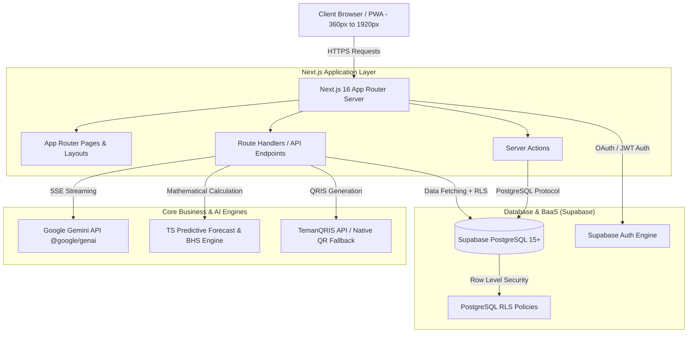
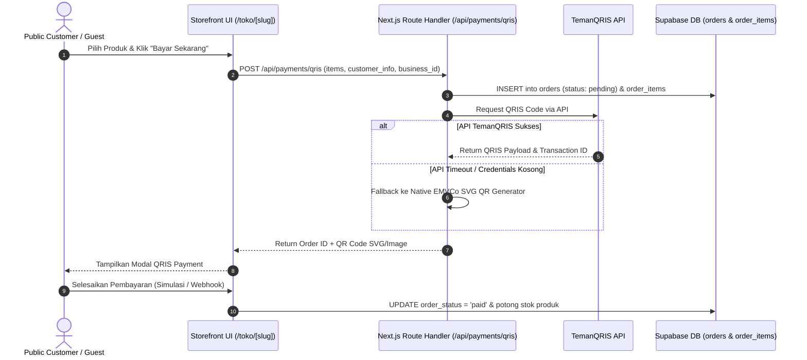
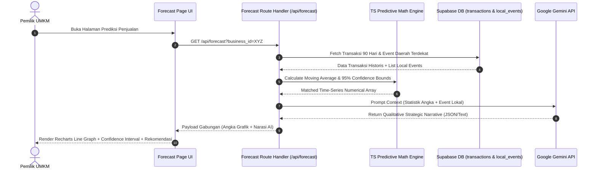

# 🏗️ System Architecture Document
## LORA (Local Omni-channel Regional Assistant)

> **Versi Dokumen:** 1.0 (MVP Competition Baseline)  
> **Target Framework:** Next.js 16 App Router + Supabase + Google Gemini API  

---

## 📐 1. Arsitektur Tingkat Tinggi (High-Level System Architecture)

Sistem LORA mengadopsi arsitektur **Serverless Edge & Cloud Hybrid** berbasis Next.js 16 App Router dan Supabase Managed Infrastructure.



---

## 🛠️ 2. Tech Stack Detail

| Layer | Teknologi / Library | Versi | Rationale / Kegunaan |
| :--- | :--- | :--- | :--- |
| **Frontend & Server** | Next.js App Router | `16.3.0` | Server Components default, React 19, Server Actions, & Route Handlers. |
| **UI Framework** | Tailwind CSS + Shadcn UI | `^4.0` / `^4.16` | UI modern berbasis token warna (Deep Indigo & Terracotta Warm). |
| **Icons & Visuals** | Lucide React + Recharts | `^1.29` / `^3.10` | Visualisasi grafik interaktif omzet, BHS, dan prediktif interval. |
| **Database & BaaS** | Supabase Managed Cloud | `@supabase/supabase-js ^2.109` | PostgreSQL 15+, Auth Engine, Realtime Engine, & Row Level Security. |
| **AI Provider** | Google Gemini API | `@google/genai ^2.16` | Model `gemini-1.5-flash` / `gemini-2.0-flash` untuk Conversational BI. |
| **Payment Gateway** | TemanQRIS API + Native EMVCo | Custom Service | In-App Payment Checkout dengan *Graceful Fallback* ke SVG QR Generator. |

---

## 📂 3. Struktur Folder & Modul Aplikasi (`src/`)

```
src/
├── app/
│   ├── (admin)/
│   │   └── admin/events/page.tsx          # Admin Event Management (Input Tanggal & Kegiatan)
│   ├── (auth)/
│   │   ├── login/page.tsx
│   │   └── register/page.tsx
│   ├── (dashboard)/
│   │   ├── dashboard/page.tsx             # Overview KPI & BHS Score
│   │   ├── inventory/page.tsx             # Smart Inventory & ROP Alert
│   │   ├── forecast/page.tsx              # Hybrid Sales Forecast
│   │   ├── ai-consultant/page.tsx         # Realtime SSE Chatbot
│   │   ├── events/page.tsx                # Local Trend Analyzer (DIY-Jateng View)
│   │   └── settings/page.tsx              # Profil UMKM & Switch Role
│   ├── (storefront)/
│   │   └── toko/[slug]/
│   │       ├── page.tsx                   # Public Digital Storefront (Guest/Customer)
│   │       └── checkout/page.tsx          # In-App Payment Checkout & QRIS Generator
│   ├── api/
│   │   ├── admin/
│   │   │   └── events/route.ts            # CRUD API Master Event (Admin Only)
│   │   ├── ai/
│   │   │   ├── chat/route.ts              # SSE Streaming Gemini API Handler
│   │   │   └── BHS/route.ts               # BHS Calculation Endpoint
│   │   ├── payments/
│   │   │   └── qris/route.ts              # TemanQRIS / Native QR Engine API
│   │   └── forecast/route.ts              # Hybrid Statistical Engine
│   ├── layout.tsx
│   └── page.tsx                           # Landing Page & Storefront Directory
├── components/
│   ├── ui/                                # Shadcn UI Primitives
│   ├── dashboard/                         # KPI Cards, Recharts Containers, BHS Gauge
│   ├── storefront/                        # Product Card, Cart Sheet, QRIS Modal
│   └── ai/                                # Chat Drawer, Message Bubble, Stream Renderer
├── lib/
│   ├── supabase/
│   │   ├── client.ts                      # Browser Supabase Client
│   │   ├── server.ts                      # Server-side Supabase Client (Cookies)
│   │   └── middleware.ts                  # Auth Guard & Role Redirect Middleware
│   ├── engines/
│   │   ├── bhs-engine.ts                  # Perhitungan 6 Indikator Business Health Score
│   │   ├── predictive-forecast.ts         # Math Engine (Moving Avg / Holt-Winters)
│   │   └── qris-generator.ts              # Native EMVCo SVG QR Generator Engine
│   └── utils.ts
```

---

## 🔄 4. Alur Data Utama (Core Data Flows)

### 4.1 In-App Payment Checkout Data Flow


### 4.2 Hybrid Sales Forecast Data Flow


---

## 🛡️ 5. Arsitektur Keamanan & Isolasi Multi-Tenant (RLS)

1. **Supabase Auth Integration**: Setiap request yang membutuhkan otentikasi membawa JWT Token yang diparsing oleh Supabase Middleware di Next.js.
2. **Row Level Security (RLS)**:
   - Akses data tabel `businesses`, `products`, `orders`, `inventory`, `business_health_scores` diisolasi ketat di tingkat PostgreSQL.
   - Kebijakan RLS memastikan `business_id` pembaca harus cocok dengan `owner_id` di tabel `profiles` yang sedang terautentikasi (`auth.uid()`).
3. **Guest Read-Only Policies**:
   - Tabel `businesses` dan `products` memiliki RLS Policy publik `FOR SELECT USING (true)` sehingga Guest/Pengunjung dapat melihat katalog toko tanpa authentication header.

---

## ⚙️ 6. Resiliency & Failure Mitigation Strategies

1. **API Fallback Circuit Breaker (TemanQRIS)**:
   - Jika endpoint TemanQRIS mengalami delay > 3.0 detik atau mengembalikan HTTP Status 5xx, sistem secara otomatis mengeksekusi *Native QRIS SVG Engine* internal tanpa menghentikan alur checkout pengguna.
2. **Graceful Degradation (Gemini API)**:
   - Jika Gemini API terkena *rate-limit* (HTTP 429) atau downtime, fitur BHS Engine dan Sales Forecast tetap menampilkan angka matematika deterministik beserta *template fallback narrative* lokal tanpa membuat UI *crash*.
