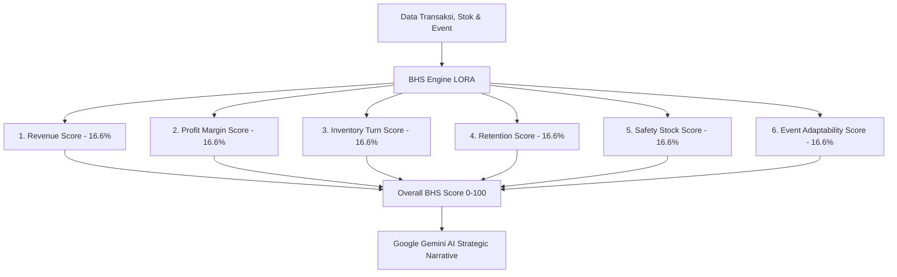

# 🩺 Dokumentasi Teknis: Business Health Score (BHS) Engine

> **Sistem:** LORA (Local Omni-channel Regional Assistant)  
> **Modul:** Business Health Score & Multi-Dimensional Diagnostic Engine  
> **Versi:** 2.0 (6-Pillar Composite Algorithm + Gemini AI Narrative)  
> **Target Wilayah:** Daerah Istimewa Yogyakarta & Jawa Tengah  

---

## 📌 1. Ikhtisar & Filosofi Sistem

**Business Health Score (BHS) LORA** adalah sistem evaluasi kesehatan bisnis komposit berbasis data riil transaksi toko UMKM dengan skala **0 hingga 100**.

BHS dirancang untuk memberikan diagnosis holistik, bukan hanya melihat omzet semata, melainkan mengevaluasi 6 dimensi vital operasional perdagangan:
1. **Kekuatan Finansial / Omzet (*Revenue Score*)**
2. **Tingkat Keuntungan Rata-rata (*Profit Margin Score*)**
3. **Efisiensi Perputaran Barang (*Inventory Turn Score*)**
4. **Loyalitas & Pembelian Berulang (*Customer Retention Score*)**
5. **Keamanan Cadangan Barang (*Safety Stock Score*)**
6. **Kesiapan Menghadapi Agenda Wisata Daerah (*Event Adaptability Score*)**

---

## 📐 2. Formulasi Matematika 6 Pilar BHS



---

### 2.1 Pilar 1: Revenue Score ($R_{\text{score}}$) — Omzet Bulanan
Mengukur pencapaian omzet toko selama **30 hari terakhir** terhadap target *benchmark* UMKM regional berkembang di DIY-Jateng ($\text{Rp } 15.000.000$).

$$R_{\text{score}} = \min\left( \frac{\text{Total Omzet}_{30d}}{\text{Rp } 15.000.000} \times 100, 100 \right)$$
*Jika toko telah memiliki transaksi riil, diberikan nilai ambang minimum $R_{\text{score}} \ge 20$.*

---

### 2.2 Pilar 2: Profit Margin Score ($M_{\text{score}}$) — Nilai Rata-rata Keranjang
Didekati melalui nilai *Average Order Value (AOV)* dalam 30 hari terakhir:

$$\text{AOV} = \frac{\text{Total Omzet}_{30d}}{\text{Jumlah Transaksi Sukses}_{30d}}$$

| Nilai AOV (Rupiah) | Skor $M_{\text{score}}$ | Interpretasi Skala Margin |
| :--- | :---: | :--- |
| $\text{AOV} \ge \text{Rp } 250.000$ | **95** | Margin & Nilai Keranjang Sangat Tinggi (Premium/Batik Tulis) |
| $\text{Rp } 150.000 \le \text{AOV} < \text{Rp } 250.000$ | **85** | Margin Sehat / Paket Bundling Menengah |
| $\text{Rp } 80.000 \le \text{AOV} < \text{Rp } 150.000$ | **75** | Standar Retail UMKM Kuliner & Suvenir |
| $\text{AOV} < \text{Rp } 80.000$ | **60** | Nilai Keranjang Rendah / Perlu Upselling |

---

### 2.3 Pilar 3: Inventory Turn Score ($T_{\text{score}}$) — Perputaran Stok
Mengukur seberapa cepat stok fisik di gudang berputar menjadi penjualan dalam 30 hari terakhir:

$$\text{Turn Rate} = \frac{\text{Kuantitas Produk Terjual}_{30d}}{\max\left(\text{Kuantitas Terjual}_{30d} + \text{Total Stok Tersisa}, 1\right)}$$

$$T_{\text{score}} = \min\left(\text{Turn Rate} \times 400, 100\right)$$
*Turn rate $25\%$ per bulan dinormalisasi menjadi skor sempurna ($100$). Jika ada transaksi, skor minimum adalah $30$.*

---

### 2.4 Pilar 4: Customer Retention Score ($Ret_{\text{score}}$) — Retensi Pelanggan
Mengukur loyalitas pembeli terdaftar dalam jendela analisis **90 hari terakhir**:

$$\text{Repeat Customer Rate} = \frac{\text{Jumlah Pembeli Transaksi } \ge 2}{\text{Total Pembeli Unik Terdaftar}} \times 100\%$$

$$Ret_{\text{score}} = \min\left( \frac{\text{Repeat Customer Rate}}{20\%} \times 100, 100 \right)$$
*Tingkat repeat order $20\%$ merupakan standar industri retail yang sangat sehat dan menghasilkan skor $100$.*

---

### 2.5 Pilar 5: Safety Stock Score ($S_{\text{score}}$) — Keamanan Stok & ROP
Dimulai dari nilai awal $100$ poin, kemudian dikurangi penalti proporsional berdasarkan jumlah produk bermasalah:

$$\text{Penalti} = \left( \frac{N_{\text{habis}}}{N_{\text{total}}} \times 50 \right) + \left( \frac{N_{\text{low\_rop}}}{N_{\text{total}}} \times 20 \right) + \left( \frac{N_{\text{overstock}}}{N_{\text{total}}} \times 10 \right)$$

$$S_{\text{score}} = \max\left(100 - \text{Penalti}, 10\right)$$

* $N_{\text{habis}}$: Jumlah produk dengan $\text{Stok} \le 0$ (Bobot penalti $50$).
* $N_{\text{low\_rop}}$: Jumlah produk dengan $0 < \text{Stok} \le \text{ROP}$ (Bobot penalti $20$).
* $N_{\text{overstock}}$: Jumlah produk dengan $\text{Stok} > 2.5 \times \text{ROP}$ (Bobot penalti $10$).

---

### 2.6 Pilar 6: Event Adaptability Score ($E_{\text{score}}$) — Kesiapan Event Budaya
Mengukur kemampuan toko memanfaatkan agenda wisata & kebudayaan terdekat di provinsinya (DIY / Jawa Tengah):

1. **Ada Event Terdekat + Stok Produk Aman**: Skor **$95$** (atau **$100$** jika sudah ada penjualan aktif).
2. **Ada Event Terdekat + Ada Produk Kritis/Habis**: Skor **$65$** (Peringatan potensi kehilangan peluang pariwisata).
3. **Kondisi Normal (Tidak ada event aktif)**: Skor baseline **$80$**.

---

## 🏆 3. Perhitungan Skor Keseluruhan (*Overall BHS Score*)

Skor akhir dihitung menggunakan rata-rata terbobot seimbang (*equal-weighted average*) dari keenam pilar:

$$\text{Overall BHS} = \left\lfloor \frac{R_{\text{score}} + M_{\text{score}} + T_{\text{score}} + Ret_{\text{score}} + S_{\text{score}} + E_{\text{score}}}{6} \right\rceil$$

### Kategori Level Kesehatan Bisnis:

| Rentang Skor | Tingkat Kesehatan | Badge UI & Warna Gauge | Rekomendasi Tindakan |
| :---: | :--- | :--- | :--- |
| **$75 - 100$** | **🏪 Sehat & Prima** | `bg-emerald-500/10 text-emerald-500 border-emerald-500/20` | Pertahankan operasional, tingkatkan promosi ekspansi pasar. |
| **$50 - 74$** | **⚠️ Butuh Perhatian** | `bg-amber-500/10 text-amber-500 border-amber-500/20` | Tinjau pilar terlemah (misal restock produk ROP atau cuci gudang overstock). |
| **$0 - 49$** | **🚨 Kritis** | `bg-rose-500/10 text-rose-500 border-rose-500/20` | Intervensi darurat pada suplai dan arus kas toko. |

---

## 🤖 4. Integrasi AI Narrative (Google Gemini 2.0 Flash)

Hasil perhitungan matematis diolah menjadi narasi strategis kualitatif 1 paragraf (3–4 kalimat) yang ramah pedagang:

```typescript
// Prompt Gemini AI LORA untuk BHS
const promptText = `
Anda adalah Asisten AI LORA untuk Konsultan Bisnis UMKM di ${businessProvince}.
Menganalisis tingkat kesehatan bisnis "${businessName}" berdasarkan skor Business Health Score (skala 0-100):
- Skor Keseluruhan: ${breakdown.overall_score}/100
- Detail Pilar:
  1. Omzet: ${breakdown.revenue_score}/100
  2. Profit Margin: ${breakdown.margin_score}/100
  3. Turn Rate Stok: ${breakdown.inventory_turn_score}/100
  4. Retensi Pelanggan: ${breakdown.retention_score}/100
  5. Keamanan Stok: ${breakdown.safety_stock_score}/100
  6. Adaptasi Event: ${breakdown.event_adaptability_score}/100

Tugas:
Buat narasi analisis strategis 1 paragraf ringkas yang menyimpulkan kondisi toko, menunjukkan pilar terlemah, dan memberikan saran aksi taktis terarah.
`;
```

### Mekanisme *Deterministic Fallback* (Offline / Fallback Safe):
Jika koneksi API AI Gemini tidak tersedia, sistem menggunakan aturan cerdas berbasis batas (*rule-based recommendations*) otomatis dari file [`bhs-engine.ts`](file:///d:/LOMBA/APPS%20DEV%20-%20UIN%20GUSDUR/src/lib/engines/bhs-engine.ts).

---

## 🗄️ 5. Skema Database (`business_health_scores`)

```sql
CREATE TABLE IF NOT EXISTS public.business_health_scores (
    id UUID PRIMARY KEY DEFAULT gen_random_uuid(),
    business_id UUID NOT NULL REFERENCES public.businesses(id) ON DELETE CASCADE,
    overall_score NUMERIC(5, 2) NOT NULL,
    revenue_score NUMERIC(5, 2) NOT NULL,
    margin_score NUMERIC(5, 2) NOT NULL,
    inventory_turn_score NUMERIC(5, 2) NOT NULL,
    retention_score NUMERIC(5, 2) NOT NULL,
    safety_stock_score NUMERIC(5, 2) NOT NULL,
    event_adaptability_score NUMERIC(5, 2) NOT NULL,
    ai_narrative TEXT,
    calculated_at TIMESTAMPTZ DEFAULT timezone('utc'::text, now()) NOT NULL
);

CREATE INDEX IF NOT EXISTS idx_bhs_business_calculated 
ON public.business_health_scores(business_id, calculated_at DESC);
```

---

## 🔌 6. API Endpoint: `GET /api/ai/bhs`

* **Method**: `GET`
* **Query Params**: `businessId=<UUID>` (Opsional jika sesi penjual aktif).
* **Response Contoh**:
  ```json
  {
    "success": true,
    "business_id": "uuid-toko",
    "business_name": "Batik Tradisi Parang",
    "overall_score": 82,
    "revenue_score": 78,
    "margin_score": 85,
    "inventory_turn_score": 75,
    "retention_score": 80,
    "safety_stock_score": 90,
    "event_adaptability_score": 95,
    "ai_narrative": "Toko Anda dalam kondisi Sehat & Prima dengan skor 82/100. Kesiapan stok menjelang Sekaten Yogyakarta sangat baik, namun perhatikan restock untuk 2 produk batik tulis yang mendekati batas ROP."
  }
  ```
