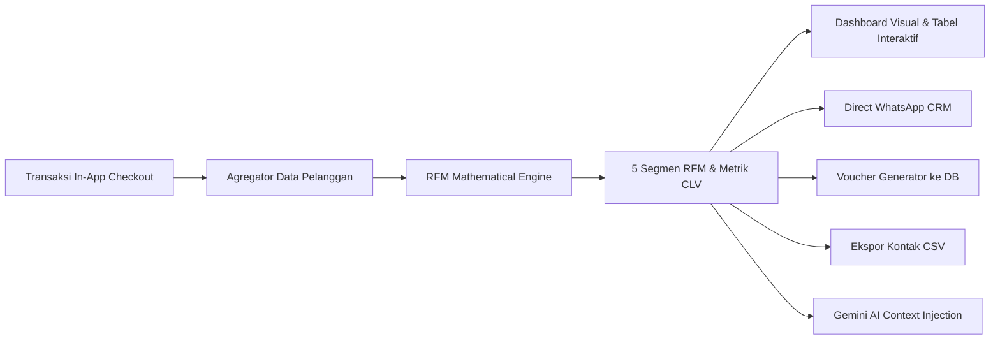

# 👥 Dokumentasi Teknis: Customer Insights & RFM Segmentation LORA

> **Sistem:** LORA (Local Omni-channel Regional Assistant)  
> **Modul:** Customer Insights, RFM Segmentation & CRM Action Engine  
> **Versi:** 2.0 (Hybrid Threshold + Quintile Scoring + In-App Checkout Voucher + Gemini AI)  
> **Target Wilayah:** Daerah Istimewa Yogyakarta & Jawa Tengah  

---

## 📌 1. Ikhtisar & Nilai Bisnis (Executive Overview)

Pelaku UMKM lokal di sektor Batik, Kuliner, Oleh-oleh, dan Kerajinan umumnya menghadapi tantangan besar dalam mempertahankan pelanggan (*customer retention*):
1. **Buta Karakteristik Pembeli:** Pedagang tidak mengetahui siapa pelanggan setia mereka, siapa yang berpotensi menjadi pembeli rutin, dan siapa yang hampir hilang (*churn*).
2. **Promosi Pukul Rata (Blunder Marketing):** Mengirimkan promo diskon yang sama ke semua orang tanpa mempertimbangkan loyalitas dan nilai belanja.
3. **Ketiadaan Tindak Lanjut Otomatis:** Kesulitan merancang pesan promosi dan kode kupon yang terpersonalisasi secara cepat.

Modul **Customer Insights & RFM Segmentation LORA** memecahkan masalah ini dengan mengolah data riwayat transaksi *In-App Checkout* menjadi analisis segmen perilaku berbasis **Recency, Frequency, dan Monetary (RFM)** yang dilengkapi alat eksekusi langsung (*Direct WhatsApp Broadcast*, *Dynamic Coupon Generator*, *Ekspor Kontak CSV*, serta *Modal Riwayat Pembelian*).



---

## 📐 2. Formulasi Matematika & Algoritma RFM

Modul [`src/lib/engines/rfm-engine.ts`](file:///d:/LOMBA/APPS%20DEV%20-%20UIN%20GUSDUR/src/lib/engines/rfm-engine.ts) mengimplementasikan arsitektur hybrid kuantitatif:

### 2.1 Ekstraksi Tiga Dimensi Utama
Untuk setiap pelanggan terdaftar ($i$):
1. **Recency ($R_i$):** Jumlah hari kalender sejak transaksi sukses terakhir pelanggan hingga tanggal referensi analisis ($T_{\text{ref}}$).
   $$R_i = \left\lfloor \frac{|T_{\text{ref}} - T_{\text{last}, i}|}{86.400.000 \text{ ms}} \right\rfloor$$
2. **Frequency ($F_i$):** Jumlah total transaksi sukses (`order_status = 'completed'` atau `payment_status = 'paid'`).
   $$F_i = \sum \mathbb{I}(\text{order}_k \text{ valid})$$
3. **Monetary ($M_i$):** Total nilai uang rupiah yang dibelanjakan pelanggan pada toko tersebut.
   $$M_i = \sum_{k} \text{total\_amount}_{i, k}$$

---

### 2.2 Dual-Engine Scoring: Hybrid Threshold ($N < 5$) & Dynamic Quintile ($N \ge 5$)

Untuk menjamin keadilan penilaian pada toko yang baru buka (*cold-start*) maupun toko dengan ribuan transaksi:

#### A. Ambang Batas Absolut (*Absolute Thresholds*) untuk Toko Baru ($N < 5$)
Jika data pelanggan $< 5$ orang, sistem menggunakan acuan nilai mutlak:
- **Recency ($R$)**: $\le 7\text{ hari} \rightarrow 5$, $\le 14\text{ hari} \rightarrow 4$, $\le 30\text{ hari} \rightarrow 3$, $\le 60\text{ hari} \rightarrow 2$, $> 60\text{ hari} \rightarrow 1$.
- **Frequency ($F$)**: $\ge 5 \rightarrow 5$, $3-4 \rightarrow 4$, $2 \rightarrow 3$, $1 \rightarrow 2$.
- **Monetary ($M$)**: $\ge \text{Rp } 1.000.000 \rightarrow 5$, $\ge \text{Rp } 500.000 \rightarrow 4$, $\ge \text{Rp } 250.000 \rightarrow 3$, $\ge \text{Rp } 100.000 \rightarrow 2$, $< \text{Rp } 100.000 \rightarrow 1$.

#### B. Kuantil Persentil Dinamis (*Dynamic Quintiles*) untuk Toko Mapan ($N \ge 5$)
Nilai mentah $R, F, M$ diskalakan ke skor $1 - 5$ berdasarkan posisi persentil relatif:
$$\text{Percentile}(x_i) = \frac{\text{Rank}(x_i)}{N - 1}, \quad N = \text{Total Pelanggan}$$

| Rentang Persentil | Skor Normal ($F, M$) | Skor Terbalik ($R$) | Keterangan |
| :--- | :---: | :---: | :--- |
| $\text{Percentile} \ge 0.80$ | **5** | **1** | $20\%$ Teratas |
| $0.60 \le \text{Percentile} < 0.80$ | **4** | **2** | $20\%$ Menengah Atas |
| $0.40 \le \text{Percentile} < 0.60$ | **3** | **3** | $20\%$ Median |
| $0.20 \le \text{Percentile} < 0.40$ | **2** | **4** | $20\%$ Menengah Bawah |
| $\text{Percentile} < 0.20$ | **1** | **5** | $20\%$ Terbawah |

---

### 2.3 Aturan Klasifikasi 5 Segmen Pelanggan

```mermaid
flowchart TD
    Start([Profil Skor Pelanggan]) --> C1{R >= 4 & F >= 4 & M >= 4?}
    C1 -- Ya --> Seg1["🏆 Champions (VIP)"]
    C1 -- Tidak --> C2{R >= 3 & F >= 3?}
    C2 -- Ya --> Seg2["🤝 Loyal Customers"]
    C2 -- Tidak --> C3{R >= 3 & F <= 2?}
    C3 -- Ya --> Seg3["✨ Potential Loyalists"]
    C3 -- Tidak --> C4{R <= 2 & (F >= 3 | M >= 3)?}
    C4 -- Ya --> Seg4["⚠️ At Risk (Win-back)"]
    C4 -- Tidak --> Seg5["💤 Hibernating (Inaktif)"]
```

| Segmen | Kriteria Skor | Karakteristik Perilaku | Rekomendasi Strategis Toko |
| :--- | :--- | :--- | :--- |
| **Champions** | $R \ge 4, F \ge 4, M \ge 4$ | Pembeli terbaik, belanja baru-baru ini, frekuensi tinggi, nominal besar. | Berikan apresiasi VIP, *early access* produk edisi terbatas, bonus merchandise. |
| **Loyal Customers** | $R \ge 3, F \ge 3$ | Berlangganan rutin dengan loyalitas tinggi dan respon positif terhadap produk. | Tawarkan produk komplementer (*cross-selling*), voucher diskon pembelian rutin. |
| **Potential Loyalists** | $R \ge 3, F \le 2$ | Pelanggan baru atau pembeli berkala dengan kepuasan baik. | Tawarkan diskon transaksi kedua untuk mendorong menjadi pelanggan tetap. |
| **At Risk** | $R \le 2 \land (F \ge 3 \lor M \ge 3)$ | Dulunya sering belanja/belanja besar, tapi sudah lama tidak bertransaksi. | Kirimkan pesan *win-back* personal dan voucher re-aktivasi (*cashback* spesial). |
| **Hibernating** | Skor sisa lainnya | Sudah lama tidak belanja dan frekuensi/nominal rendah. | Tawarkan produk terlaris (*best-seller*) dengan diskon cuci gudang / perkenalan ulang. |

---

### 2.4 Metriks Finansial & Customer Lifetime Value (CLV)

1. **Repeat Customer Rate (%)**:
   $$\text{Repeat Rate} = \left( \frac{\text{Jumlah Pelanggan dengan } F > 1}{\text{Total Pelanggan Terdaftar}} \right) \times 100$$
2. **Average Order Value (AOV)**:
   $$\text{AOV} = \frac{\sum \text{Revenue}}{\sum \text{Orders}}$$
3. **Estimated Customer Lifetime Value (CLV)**:
   $$\text{CLV} = \text{Average Customer Spend} \times \left(1 + \frac{\text{Repeat Rate}}{100}\right)$$

---

## 🗄️ 3. Skema Basis Data & Integrasi Voucher

### Tabel `public.vouchers`
File skema: [`docs/Schema.md`](file:///d:/LOMBA/APPS%20DEV%20-%20UIN%20GUSDUR/docs/Schema.md)

```sql
CREATE TABLE IF NOT EXISTS public.vouchers (
  id UUID DEFAULT gen_random_uuid() PRIMARY KEY,
  business_id UUID REFERENCES public.businesses(id) ON DELETE CASCADE NOT NULL,
  code TEXT NOT NULL,
  discount_type TEXT NOT NULL CHECK (discount_type IN ('percent', 'fixed')),
  discount_value NUMERIC NOT NULL,
  target_segment TEXT,
  min_order_amount NUMERIC DEFAULT 0,
  usage_limit INTEGER DEFAULT 100,
  times_used INTEGER DEFAULT 0,
  is_active BOOLEAN DEFAULT true,
  starts_at TIMESTAMP WITH TIME ZONE DEFAULT timezone('utc'::text, now()) NOT NULL,
  expires_at TIMESTAMP WITH TIME ZONE,
  created_at TIMESTAMP WITH TIME ZONE DEFAULT timezone('utc'::text, now()) NOT NULL,
  CONSTRAINT unique_business_voucher_code UNIQUE (business_id, code)
);
```

---

## 🌐 4. Arsitektur API Endpoints

1. **`GET /api/analytics/customers`**:
   - Menghitung segmentasi RFM dan menyertakan `order_history` beserta rincian item produk (`order_items`).
   - Menyediakan data simulasi demo DIY-Jateng jika toko belum memiliki transaksi.
2. **`POST /api/vouchers`**:
   - Menyimpan kode kupon baru dengan `starts_at`, `expires_at`, kuota pemakaian, dan minimal belanja ke tabel `vouchers`.
3. **`GET /api/vouchers`**:
   - Mengambil daftar kupon aktif toko.
4. **`POST /api/vouchers/validate`**:
   - Endpoint publik untuk validasi kupon saat pembeli memasukkan kode di halaman In-App Checkout (`/toko/[slug]/checkout`).
   - Memvalidasi status aktif, rentang tanggal `starts_at` & `expires_at`, batas kuota, serta minimal order.

---

## 🛍️ 5. Integrasi Storefront In-App Checkout

Halaman checkout etalase publik ([`src/app/(storefront)/toko/[slug]/checkout/page.tsx`](file:///d:/LOMBA/APPS%20DEV%20-%20UIN%20GUSDUR/src/app/%28storefront%29/toko/%5Bslug%5D/checkout/page.tsx)) kini dilengkapi:
- Formulir input kupon promo dinamis dengan tombol **"Gunakan"**.
- Validasi real-time via API `/api/vouchers/validate`.
- Tampilan rincian potongan kupon hijau (`- Rp ...`) dan kalkulasi tagihan efektif akhir sebelum pembayaran (QRIS, Transfer Bank, atau Kasir).

---

## 🎨 6. Fitur Antarmuka Pengguna & Actionable CRM

File: [`src/app/(dashboard)/dashboard/customers/page.tsx`](file:///d:/LOMBA/APPS%20DEV%20-%20UIN%20GUSDUR/src/app/%28dashboard%29/dashboard/customers/page.tsx)

1. **Banner Edukasi Analitik RFM**:
   - Menjelaskan nilai strategis segmentasi RFM untuk pertumbuhan retensi UMKM.
   - Menyajikan 3 kartu ringkas pilar $R$ (Recency / Kebaruan), $F$ (Frequency / Frekuensi), dan $M$ (Monetary / Moneter).
2. **Diagram Lingkaran Interaktif & Pop-up Detail Segmen**:
   - Diagram donat distribusi pembeli diletakkan di **kolom kiri**.
   - Mengklik irisan diagram lingkaran membuka **Pop-up Detail Segmen** yang menampilkan jumlah pembeli, deskripsi karakteristik, rekomendasi aksi promosi, dan tombol saring tabel.
3. **Grid 2x2 Kartu KPI Bahasa Indonesia Penuh (Kolom Kanan)**:
   - *Total Pembeli Terdaftar*
   - *Tingkat Pembelian Berulang (Repeat Rate)*
   - *Nilai Rata-rata Pesanan (Average Order Value)*
   - *Estimasi Nilai Seumur Hidup Pelanggan (Customer Lifetime Value)*
4. **Tabel Profil Pelanggan Khusus WhatsApp Direct**:
   - Kolom aksi langsung hanya menyediakan tombol **"WhatsApp"** yang memvalidasi ketersediaan nomor dari database (`profiles.phone_number`).
   - Tombol dinonaktifkan jika nomor telepon belum terdaftar di akun pembeli.
   - Mengklik baris tabel membuka **Modal Riwayat Pesanan & Produk yang Dibeli**.
5. **Section Terdedikasi: Generator & Manajemen Voucher Toko**:
   - Terletak mandiri di bawah tabel daftar pelanggan.
   - Menyediakan form pembuatan kupon promo baru dengan pengaturan tanggal aktif (`starts_at` & `expires_at`), target segmen, dan kuota pemakaian.
   - Menampilkan kartu daftar voucher aktif toko dengan tombol salin cepat 1-klik dan indikator pemakaian kuota.
6. **Tombol "Ekspor Kontak CSV"**:
   - Mengunduh daftar kontak pelanggan terfilter dalam format CSV berstandar UTF-8 BOM untuk kompatibilitas Microsoft Excel.

---

## 🤖 7. Integrasi dengan LORA AI Business Consultant

Matriks segmen pelanggan diinjeksikan ke dalam *system prompt* Google Gemini ([`src/lib/ai/prompts.ts`](file:///d:/LOMBA/APPS%20DEV%20-%20UIN%20GUSDUR/src/lib/ai/prompts.ts)) sehingga AI Consultant dapat memberikan rekomendasi retensi berbasis data real-time, seperti menyarankan pengiriman voucher win-back bagi pelanggan *At Risk* sebelum event kebudayaan daerah berlangsung.
