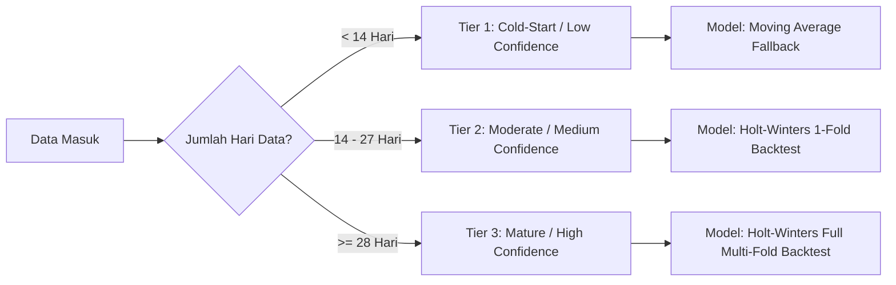

# 📈 Dokumentasi Teknis: Fitur Hybrid Sales & Order Forecasting LORA

> **Sistem:** LORA (Local Omni-channel Regional Assistant)  
> **Modul:** Predictive Business Intelligence & Demand Forecasting  
> **Versi:** 2.0 (Dual-Engine: Holt-Winters Additive + Event Overlay + Gemini AI)  
> **Target Wilayah:** Daerah Istimewa Yogyakarta & Jawa Tengah  

---

## 📌 1. Ikhtisar & Filosofi Arsitektur

Fitur **Forecasting LORA** dirancang untuk memberikan visibilitas masa depan (*forward-looking insights*) bagi pelaku UMKM di sektor Batik, Kuliner, Oleh-oleh, dan Kerajinan. Sistem ini menggabungkan:

1. **Statistika Time Series Kuantitatif**: Menggunakan algoritma **Holt-Winters Triple Exponential Smoothing (Additive Method)** untuk menangkap pola *level*, *trend*, dan *seasonality* mingguan (7 hari).
2. **Kompensasi Cold-Start**: *Simple Moving Average (SMA)* adaptif untuk toko yang baru beroperasi (< 14 hari data).
3. **Local Cultural Event Overlay**: Pengali lonjakan permintaan otomatis (*tourism surge multiplier*) berbasis agenda pariwisata daerah DIY-Jateng (seperti *Dieng Culture Festival*, *Sekaten Yogyakarta*, *Solo Batik Carnival*).
4. **Validasi Model Berkelanjutan**: *Out-of-Sample Rolling Backtesting* menggunakan metrik **MAPE (Mean Absolute Percentage Error)** dan *Auto-Tuning Grid Search* 64 kombinasi parameter.
5. **AI Strategic Narrative**: Intepretasi kualitatif ramah pedagang menggunakan **Google Gemini 2.0 Flash**.

---

## 📐 2. Formulasi Matematika & Algoritma

### 2.1 Holt-Winters Triple Exponential Smoothing (Additive Model)

Siklus musiman ditetapkan sepanjang $L = 7$ hari (merefleksikan siklus perdagangan mingguan: hari kerja vs akhir pekan).

#### Persamaan Smoothing:
1. **Level Equation ($L_t$):**
   $$L_t = \alpha (Y_t - S_{t-L}) + (1 - \alpha)(L_{t-1} + T_{t-1})$$
2. **Trend Equation ($T_t$):**
   $$T_t = \beta (L_t - L_{t-1}) + (1 - \beta) T_{t-1}$$
3. **Seasonal Equation ($S_t$):**
   $$S_t = \gamma (Y_t - L_t) + (1 - \gamma) S_{t-L}$$

#### Persamaan Peramalan ($h$ Langkah ke Depan):
$$\hat{Y}_{t+h} = L_t + h \cdot T_t + S_{t+h - L(k+1)}$$
*di mana $k = \lfloor (h - 1) / L \rfloor$, dan nilai prediksi diklem $\max(0, \hat{Y}_{t+h})$.*

---

### 2.2 Parameter yang Terlibat

| Parameter | Nama Teknis | Rentang Nilai | Default Awal | Fungsi & Peran |
| :--- | :--- | :--- | :--- | :--- |
| **$\alpha$ (Alpha)** | *Level Smoothing Factor* | $0.05 \le \alpha \le 0.95$ | `0.3` | Mengontrol bobot observasi penjualan aktual terbaru terhadap baseline level rata-rata. |
| **$\beta$ (Beta)** | *Trend Smoothing Factor* | $0.01 \le \beta \le 0.50$ | `0.1` | Mengontrol seberapa responsif model terhadap perubahan arah kenaikan/penurunan penjualan. |
| **$\gamma$ (Gamma)** | *Seasonal Smoothing Factor* | $0.05 \le \gamma \le 0.95$ | `0.3` | Mengontrol seberapa dinamis penyesuaian fluktuasi pola mingguan (misal lonjakan hari Sabtu-Minggu). |
| **$L$** | *Seasonal Length* | Tetap | `7` | Panjang siklus musiman perdagangan (7 hari = 1 minggu). |
| **$h$** | *Forecast Horizon* | `7` atau `15` | `7_days` | Jangkauan hari ke depan yang diproyeksikan (`7_days` / `15_days`). |

---

### 2.3 Grid Search Calibration (Auto-Tuning 64 Kombinasi)

Ketika tombol **"Prediksi Ulang / Kalibrasi"** ditekan, sistem menjalankan iterasi *Grid Search* untuk mencari kombinasi $(\alpha, \beta, \gamma)$ dengan MAPE terendah:

$$\alpha \in \{0.1, 0.3, 0.5, 0.8\}$$
$$\beta \in \{0.05, 0.1, 0.2, 0.3\}$$
$$\gamma \in \{0.1, 0.3, 0.5, 0.7\}$$

$$\text{Total Kombinasi} = 4 \times 4 \times 4 = 64 \text{ konfigurasi}$$

Hasil parameter optimal disimpan ke tabel `sales_forecasts` sebagai parameter aktif toko terkait.

---

## 🎯 3. Ketentuan Data & Confidence Level

Sistem secara otomatis mengklasifikasikan keandalan prediksi ke dalam 3 tier berdasarkan jumlah data historis transaksi:



| Tingkat Kepercayaan (*Confidence Level*) | Ketersediaan Data Historis | Model yang Digunakan | Status Kalibrasi |
| :--- | :--- | :--- | :--- |
| **LOW (Cold-Start)** | $< 14$ hari transaksi | *Simple Moving Average (SMA)* | Dinonaktifkan (butuh minimal 14 hari data). |
| **MEDIUM** | $14 - 27$ hari transaksi | Holt-Winters ($k=1$ Fold Backtesting) | Aktif (dapat dikalibrasi). |
| **HIGH** | $\ge 28$ hari transaksi | Holt-Winters (Multi-Fold Rolling Backtest) | Aktif penuh (akurasi validasi optimal). |

---

## 📊 4. Metrik Akurasi & Interpretasi MAPE

Akurasi model dievaluasi secara *Out-of-Sample* menggunakan **MAPE (Mean Absolute Percentage Error)**:

$$\text{MAPE} = \frac{100\%}{N} \sum_{t=1}^{N} \left| \frac{Y_t - \hat{Y}_t}{Y_t} \right|$$

### Kategori Interpretasi MAPE:
- $\text{MAPE} \le 15.0\%$: **"Sangat Baik"** (Penyimpangan minimal, sangat presisi).
- $15.1\% - 25.0\%$: **"Baik"** (Akurat untuk perencanaan stok & belanja modal).
- $25.1\% - 40.0\%$: **"Cukup"** (Memberikan gambaran tren umum, disarankan kalibrasi).
- $\text{MAPE} > 40.0\%$: **"Perlu Kalibrasi"** (Disarankan menekan tombol kalibrasi grid-search).

---

## 🎪 5. Local Event Multiplier Overlay (DIY-Jateng Engine)

LORA menghubungkan peramalan penjualan dengan master data agenda kebudayaan & pariwisata daerah pada tabel `local_events`.

### Matriks Pengali Dampak Wisatawan:

| Level Dampak (`impact`) | Pengali Proyeksi (*Multiplier*) | Estimasi Lonjakan Permintaan | Contoh Event DIY-Jateng |
| :--- | :---: | :---: | :--- |
| `low` | **$1.10\times$** | $+10\%$ | Pameran Seni Komunitas Lokal |
| `medium` | **$1.25\times$** | $+25\%$ | Festival Kuliner Kabupaten |
| `high` | **$1.45\times$** | $+45\%$ | Solo Batik Carnival, ArtJog |
| `massive` | **$1.75\times$** | $+75\%$ | Dieng Culture Festival, Sekaten Yogyakarta |

*Pengali ini secara matematis meningkatkan proyeksi omzet rupiah, estimasi jumlah order, serta batas atas/bawah interval kepercayaan selama rentang tanggal event berlangsung (`start_date` s/d `end_date`).*

---

## 🛡️ 6. Interval Kepercayaan (*Confidence Band Shading*)

Area arsiran gradien pada grafik menggambarkan batas probabilitas fluktuasi riil:

$$\text{Margin of Error} = \max\left(\frac{\text{MAPE}}{100}, 0.12\right)$$
$$\text{Confidence Lower} = \max\left(0, \hat{Y} \times (1 - \text{Margin of Error})\right)$$
$$\text{Confidence Upper} = \hat{Y} \times (1 + \text{Margin of Error})$$

---

## ⚡ 7. Deteksi Hari Ramai vs Hari Sepi

Sistem menghitung baseline gabungan:

$$\text{Baseline} = 0.4 \times \overline{\text{Histori}}_{14\text{ hari}} + 0.6 \times \overline{\text{Proyeksi}}$$

- **Hari Diprediksi Ramai:** Tanggal di mana $\hat{Y} \ge \text{Baseline} \times 1.10$ ATAU bertepatan dengan event pariwisata daerah (`impact != low`).
- **Hari Diprediksi Sepi:** Tanggal di mana $\hat{Y} \le \text{Baseline} \times 0.90$.

---

## 🤖 8. Generasi Narasi Strategis Gemini AI

Sistem mengirimkan ringkasan data terstruktur ke **Google Gemini 2.0 Flash**:

```typescript
// Payload konteks ke Gemini
const prompt = `
Anda adalah Asisten Bisnis AI Khusus UMKM di DIY & Jawa Tengah.
Data Toko:
- Total Proyeksi Omzet: ${formattedRevenue} (${growth}% vs periode lalu)
- Hari Ramai (${busyCount} hari): ${busyDays}
- Hari Sepi (${quietCount} hari): ${quietDays}
- Event Daerah: ${localEventsSummary}
- Mode: ${isFallback ? 'Cold Start' : 'Holt-Winters'}
`;
```

**Output AI:** Paragraf rekomendasi praktis 3–4 kalimat tanpa jargon teknis yang memandu pedagang kapan harus menambah stok produk siap jual dan kapan harus membatasi belanja bahan segar guna menghemat modal kas.

---

## 🔌 9. Spesifikasi API Endpoint

### 1. `GET /api/forecast`
Mengambil data time-series historis, hasil proyeksi omzet & order, status MAPE, dan narasi AI.
- **Query Params:**
  - `horizon` (opsional): `'7_days'` | `'15_days'` (default: `'7_days'`).
  - `businessId` (opsional): UUID toko spesifik.

### 2. `POST /api/forecast/calibrate`
Memicu *Grid Search 64 Kombinasi* untuk optimasi hyperparameter $\alpha, \beta, \gamma$.
- **Request Body:**
  ```json
  {
    "horizon": "7_days",
    "businessId": "uuid-toko-opsional"
  }
  ```
- **Response:**
  ```json
  {
    "success": true,
    "tuned_params": { "alpha": 0.3, "beta": 0.1, "gamma": 0.5 },
    "mape_validated": 14.2,
    "mape_interpretation": "Sangat Baik"
  }
  ```
