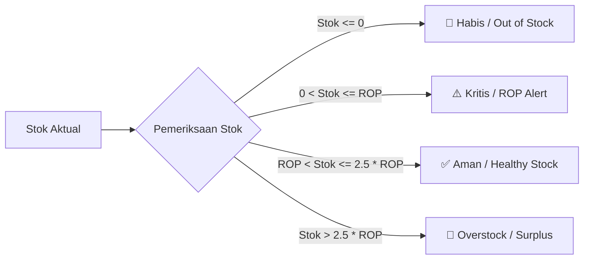
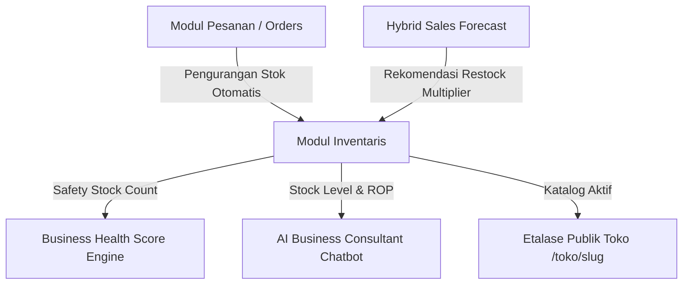

# 📦 Dokumentasi Teknis: Manajemen Inventaris, Reorder Point (ROP) & Safety Stock

> **Sistem:** LORA (Local Omni-channel Regional Assistant)  
> **Modul:** Seller Inventory Control, Automated Restock Alerts & Supply Chain Intelligence  
> **Versi:** 2.0  
> **Target Wilayah:** Daerah Istimewa Yogyakarta & Jawa Tengah  

---

## 📌 1. Ikhtisar & Tujuan Fitur

Modul **Manajemen Inventaris & ROP LORA** dirancang untuk membantu pedagang UMKM (Batik, Kuliner, Kerajinan, dan Aksesori) mengelola stok produk secara presisi, mencegah kehabisan stok (*stockout*), serta menghindari penumpukan modal kerja yang berlebihan (*overstock*).

Fitur ini terintegrasi langsung dengan:
1. **Etalase Publik Toko (`/toko/[slug]`) & Katalog Utama (`/katalog`)**: Memastikan stok yang ditampilkan selalu sinkron secara real-time.
2. **Business Health Score (BHS) Engine**: Memengaruhi pilar *Safety Stock Score* dan *Inventory Turn Score*.
3. **Hybrid Sales Forecast**: Memberikan proyeksi kebutuhan barang berdasarkan histori penjualan dan agenda wisata lokal.
4. **Cloudinary Media Storage**: Penyimpanan foto produk beresolusi tinggi dengan optimasi web.

---

## 📐 2. Formulasi Matematika & Aturan Klasifikasi Stok

Sistem mengklasifikasikan status setiap produk ke dalam 4 tingkatan matematis:



### 2.1 Parameter Dasar
* **$\text{Stok Aktual}$ ($S$)**: Jumlah fisik unit barang yang siap dijual saat ini.
* **$\text{Reorder Point}$ ($\text{ROP}$ / $\text{min\_stock}$)**: Ambang batas minimum di mana toko harus segera melakukan pemesanan ulang (*restock*) ke pengrajin atau pemasok.
* **$\text{Safety Stock}$ ($\text{SS}$)**: Cadangan pengaman penyangga untuk mengantisipasi keterlambatan pasokan (*supplier lead time delay*) atau lonjakan pesanan mendadak.

$$\text{Safety Stock} = \left\lfloor \text{ROP} \times 0.5 \right\rceil$$

---

### 2.2 Aturan Logika Klasifikasi Status

| Status | Notasi Logika | Kategori Badge UI | Implikasi Bisnis |
| :--- | :--- | :--- | :--- |
| **Habis (*Out of Stock*)** | $S \le 0$ | `bg-rose-50 text-rose-700 border-rose-200` | Produk tidak dapat dipesan di etalase; kehilangan potensi omzet seketika. |
| **Kritis (*ROP Alert*)** | $0 < S \le \text{ROP}$ | `bg-amber-50 text-amber-800 border-amber-200` | Stok mendekati batas pengaman; sistem memunculkan banner peringatan restock segera. |
| **Aman (*Optimal*)** | $\text{ROP} < S \le 2.5 \times \text{ROP}$ | `bg-emerald-50 text-emerald-700 border-emerald-200` | Rasio perputaran barang seimbang; kas toko berputar secara sehat. |
| **Overstock (*Surplus*)** | $S > 2.5 \times \text{ROP}$ | `bg-blue-50 text-blue-700 border-blue-200` | Stok melebihi 250% batas aman; modal kerja tertahan dan risiko kerusakan barang meningkat. |

---

## 🗄️ 3. Skema Data & Relasi Database (`products`)

Tabel `products` di Supabase PostgreSQL menyimpan seluruh atribut barang:

```sql
CREATE TABLE IF NOT EXISTS public.products (
    id UUID PRIMARY KEY DEFAULT gen_random_uuid(),
    business_id UUID NOT NULL REFERENCES public.businesses(id) ON DELETE CASCADE,
    name TEXT NOT NULL,
    description TEXT,
    category TEXT DEFAULT 'Batik',
    price NUMERIC(12, 2) NOT NULL DEFAULT 0,
    stock INTEGER NOT NULL DEFAULT 0,
    min_stock INTEGER NOT NULL DEFAULT 10,
    image_url TEXT,
    is_active BOOLEAN NOT NULL DEFAULT true,
    created_at TIMESTAMPTZ DEFAULT timezone('utc'::text, now()) NOT NULL,
    updated_at TIMESTAMPTZ DEFAULT timezone('utc'::text, now()) NOT NULL
);

-- Indeks untuk pencarian cepat dan join toko
CREATE INDEX IF NOT EXISTS idx_products_business_id ON public.products(business_id);
CREATE INDEX IF NOT EXISTS idx_products_category ON public.products(category);
CREATE INDEX IF NOT EXISTS idx_products_is_active ON public.products(is_active);
```

---

## 🔌 4. Arsitektur REST API Endpoints

Seluruh operasi CRUD inventaris diproteksi oleh validasi sesi penjual (`owner_id` terautentikasi):

### 4.1 `POST /api/seller/products` (Tambah Produk)
* **Headers**: `Content-Type: application/json`
* **Request Body**:
  ```json
  {
    "name": "Kain Batik Tulis Motif Parang",
    "category": "Batik",
    "price": 185000,
    "stock": 45,
    "min_stock": 10,
    "image_url": "https://res.cloudinary.com/...",
    "description": "Batik katun primissima pewarna alam khas Yogyakarta."
  }
  ```
* **Response `200 OK`**: Mengembalikan objek data produk baru yang tersimpan.

### 4.2 `PUT /api/seller/products` (Perbarui Produk / Toggle Status)
* Digunakan untuk memperbarui data parsial produk atau menonaktifkan visibilitas di etalase (`is_active: false`).
* **Request Body**:
  ```json
  {
    "id": "uuid-product-id",
    "stock": 25,
    "min_stock": 12,
    "is_active": true
  }
  ```

### 4.3 `DELETE /api/seller/products?id=<product_id>` (Hapus Produk)
* Menghapus produk dari database (dengan kaskade pembersihan referensi).

---

## 🖥️ 5. Fitur Antarmuka Pengguna (*UI/UX*)

Modul diimplementasikan pada file [`InventoryClient.tsx`](file:///d:/LOMBA/APPS%20DEV%20-%20UIN%20GUSDUR/src/components/dashboard/InventoryClient.tsx):

1. **4 Kartu Ringkasan Stok Cepat**: Menampilkan akumulasi *Total Produk*, *Stok Kritis (ROP)*, *Stok Habis*, dan *Overstock*.
2. **ROP Alert Banner Dinamis**: Otomatis muncul di bagian atas jika terdapat produk yang menyentuh status Kritis atau Habis.
3. **Pencarian & Filter Multikategori**: Filter instan berdasarkan teks pencarian (*live search*), kategori unik (*Batik, Kuliner, Kerajinan, Aksesori, Lainnya*), dan status stok (*Aman, Kritis, Habis, Overstock*).
4. **Visibilitas Etalase Instan (Toggle Eye)**: Mengizinkan penjual menyembunyikan produk yang sedang tidak diproduksi tanpa menghapusnya dari database.
5. **Modal Form Responsif**: Dialog pembuatan/pengeditan dengan validasi form, format rupiah, dan integrasi Cloudinary (*preset: lora_toko*).

---

## 🔄 6. Hubungan dengan Engine Lain



* **Dampak ke BHS (*Business Health Score*)**:
  Produk yang *Habis* memberi penalti $50\%$, produk di bawah *ROP* memberi penalti $20\%$, dan produk *Overstock* memberi penalti $10\%$ terhadap nilai pilar *Safety Stock Score*.
* **Dampak ke Transaksi Pesanan**:
  Setiap order yang berhasil diproses akan memotong kuantitas `stock` produk terkait, sehingga status ROP selalu bergerak dinamis.
