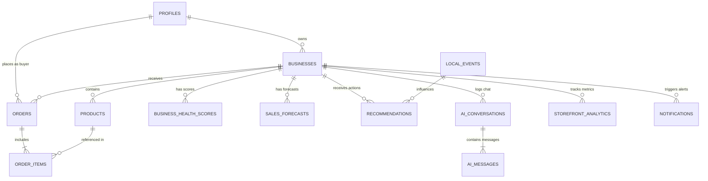

# 🗄️ Database Schema & DDL Document
## LORA (Local Omni-channel Regional Assistant)

> **Versi Dokumen:** 1.0 (MVP Competition Baseline)  
> **Basis Skema:** Mengintegrasikan Migrasi Dasar Nina (`init_schema_modul_nina.sql`) + Ekstensi AI/BI Modules  

---

## 📐 1. Diagram Relasi Entitas (ERD Blueprint)



---

## 💻 2. Complete DDL SQL Script

```sql
-- ============================================================================
-- BAGIAN 1: TABEL BASELINE ETALASE DIGITAL & AUTH (Modul Nina)
-- ============================================================================

-- 1. Tabel profiles (Multi-Role: Buyer, Seller, Admin)
CREATE TABLE IF NOT EXISTS public.profiles (
  id UUID REFERENCES auth.users(id) ON DELETE CASCADE NOT NULL PRIMARY KEY,
  full_name TEXT NOT NULL,
  phone_number TEXT,
  avatar_url TEXT,
  is_buyer BOOLEAN DEFAULT false,
  is_seller BOOLEAN DEFAULT false,
  is_admin BOOLEAN DEFAULT false,
  created_at TIMESTAMP WITH TIME ZONE DEFAULT timezone('utc'::text, now()) NOT NULL,
  updated_at TIMESTAMP WITH TIME ZONE DEFAULT timezone('utc'::text, now()) NOT NULL
);

-- 2. Tabel businesses (Etalase dengan format API Wilayah DIY & Jateng)
CREATE TABLE IF NOT EXISTS public.businesses (
  id UUID DEFAULT gen_random_uuid() PRIMARY KEY,
  owner_id UUID REFERENCES public.profiles(id) ON DELETE CASCADE NOT NULL,
  name TEXT NOT NULL,
  slug TEXT UNIQUE NOT NULL, 
  description TEXT,
  province_id TEXT,
  province_name TEXT,
  city_id TEXT,
  city_name TEXT,
  district_id TEXT,
  district_name TEXT,
  village_id TEXT,
  village_name TEXT,
  postal_code TEXT,
  address TEXT, 
  google_maps_link TEXT, 
  contact_number TEXT, 
  logo_url TEXT, 
  banner_url TEXT, 
  created_at TIMESTAMP WITH TIME ZONE DEFAULT timezone('utc'::text, now()) NOT NULL,
  updated_at TIMESTAMP WITH TIME ZONE DEFAULT timezone('utc'::text, now()) NOT NULL
);

-- 3. Tabel products (Inventori toko)
CREATE TABLE IF NOT EXISTS public.products (
  id UUID DEFAULT gen_random_uuid() PRIMARY KEY,
  business_id UUID REFERENCES public.businesses(id) ON DELETE CASCADE NOT NULL,
  name TEXT NOT NULL,
  description TEXT,
  category TEXT,
  price NUMERIC NOT NULL DEFAULT 0,
  stock INTEGER NOT NULL DEFAULT 0,
  min_stock INTEGER NOT NULL DEFAULT 10, -- Reorder Point (ROP)
  image_url TEXT,
  is_active BOOLEAN DEFAULT true,
  created_at TIMESTAMP WITH TIME ZONE DEFAULT timezone('utc'::text, now()) NOT NULL,
  updated_at TIMESTAMP WITH TIME ZONE DEFAULT timezone('utc'::text, now()) NOT NULL
);

-- 4. Tabel orders (Transaksi In-App Checkout dengan TemanQRIS)
CREATE TABLE IF NOT EXISTS public.orders (
  id UUID DEFAULT gen_random_uuid() PRIMARY KEY,
  customer_id UUID REFERENCES public.profiles(id) ON DELETE SET NULL,
  business_id UUID REFERENCES public.businesses(id) ON DELETE CASCADE NOT NULL,
  total_amount NUMERIC NOT NULL,
  order_status TEXT DEFAULT 'pending' CHECK (order_status IN ('pending', 'processing', 'completed', 'cancelled')),
  payment_status TEXT DEFAULT 'pending' CHECK (payment_status IN ('pending', 'paid', 'failed', 'expired')),
  payment_method TEXT DEFAULT 'qris',
  temanqris_transaction_id TEXT, 
  temanqris_qr_code TEXT, 
  created_at TIMESTAMP WITH TIME ZONE DEFAULT timezone('utc'::text, now()) NOT NULL,
  updated_at TIMESTAMP WITH TIME ZONE DEFAULT timezone('utc'::text, now()) NOT NULL
);

-- 5. Tabel order_items (Detail barang di dalam transaksi)
CREATE TABLE IF NOT EXISTS public.order_items (
  id UUID DEFAULT gen_random_uuid() PRIMARY KEY,
  order_id UUID REFERENCES public.orders(id) ON DELETE CASCADE NOT NULL,
  product_id UUID REFERENCES public.products(id) ON DELETE SET NULL,
  quantity INTEGER NOT NULL,
  price_per_item NUMERIC NOT NULL, 
  created_at TIMESTAMP WITH TIME ZONE DEFAULT timezone('utc'::text, now()) NOT NULL,
  updated_at TIMESTAMP WITH TIME ZONE DEFAULT timezone('utc'::text, now()) NOT NULL
);


-- ============================================================================
-- BAGIAN 2: EKSTENSI TABEL AI & BUSINESS INTELLIGENCE (LORA Engine)
-- ============================================================================

-- 6. Tabel business_health_scores (Perhitungan BHS Engine 0-100)
CREATE TABLE IF NOT EXISTS public.business_health_scores (
  id UUID DEFAULT gen_random_uuid() PRIMARY KEY,
  business_id UUID REFERENCES public.businesses(id) ON DELETE CASCADE NOT NULL,
  overall_score NUMERIC(5,2) NOT NULL, -- Skor 0.00 - 100.00
  revenue_score NUMERIC(5,2) NOT NULL,
  margin_score NUMERIC(5,2) NOT NULL,
  inventory_turn_score NUMERIC(5,2) NOT NULL,
  retention_score NUMERIC(5,2) NOT NULL,
  safety_stock_score NUMERIC(5,2) NOT NULL,
  event_adaptability_score NUMERIC(5,2) NOT NULL,
  ai_narrative TEXT,
  calculated_at TIMESTAMP WITH TIME ZONE DEFAULT timezone('utc'::text, now()) NOT NULL
);

-- 7. Tabel sales_forecasts (Hasil Hybrid Model Prediksi Penjualan)
CREATE TABLE IF NOT EXISTS public.sales_forecasts (
  id UUID DEFAULT gen_random_uuid() PRIMARY KEY,
  business_id UUID REFERENCES public.businesses(id) ON DELETE CASCADE NOT NULL,
  forecast_date DATE NOT NULL,
  predicted_sales NUMERIC NOT NULL,
  confidence_lower NUMERIC NOT NULL,
  confidence_upper NUMERIC NOT NULL,
  ai_qualitative_note TEXT,
  created_at TIMESTAMP WITH TIME ZONE DEFAULT timezone('utc'::text, now()) NOT NULL
);

-- 8. Tabel recommendations (Smart Inventory & Actionable AI Insights)
CREATE TABLE IF NOT EXISTS public.recommendations (
  id UUID DEFAULT gen_random_uuid() PRIMARY KEY,
  business_id UUID REFERENCES public.businesses(id) ON DELETE CASCADE NOT NULL,
  category TEXT CHECK (category IN ('inventory', 'pricing', 'event_promo', 'customer_retention')),
  title TEXT NOT NULL,
  description TEXT NOT NULL,
  priority TEXT DEFAULT 'medium' CHECK (priority IN ('low', 'medium', 'high', 'critical')),
  is_resolved BOOLEAN DEFAULT false,
  created_at TIMESTAMP WITH TIME ZONE DEFAULT timezone('utc'::text, now()) NOT NULL
);

-- 9. Tabel local_events (Master Data Kalender Event Kebudayaan/Pariwisata DIY-Jateng)
CREATE TABLE IF NOT EXISTS public.local_events (
  id UUID DEFAULT gen_random_uuid() PRIMARY KEY,
  title TEXT NOT NULL,
  province_name TEXT NOT NULL, -- 'DI Yogyakarta' / 'Jawa Tengah'
  city_name TEXT,
  start_date DATE NOT NULL,
  end_date DATE NOT NULL,
  description TEXT,
  expected_tourist_impact TEXT CHECK (expected_tourist_impact IN ('low', 'medium', 'high', 'massive')),
  created_at TIMESTAMP WITH TIME ZONE DEFAULT timezone('utc'::text, now()) NOT NULL
);

-- 10. Tabel ai_conversations (Percakapan Konsultan AI BI)
CREATE TABLE IF NOT EXISTS public.ai_conversations (
  id UUID DEFAULT gen_random_uuid() PRIMARY KEY,
  business_id UUID REFERENCES public.businesses(id) ON DELETE CASCADE NOT NULL,
  title TEXT DEFAULT 'Konsultasi Bisnis',
  created_at TIMESTAMP WITH TIME ZONE DEFAULT timezone('utc'::text, now()) NOT NULL
);

-- 11. Tabel ai_messages (Detail Pesan Streaming Gemini API)
CREATE TABLE IF NOT EXISTS public.ai_messages (
  id UUID DEFAULT gen_random_uuid() PRIMARY KEY,
  conversation_id UUID REFERENCES public.ai_conversations(id) ON DELETE CASCADE NOT NULL,
  sender TEXT CHECK (sender IN ('user', 'assistant')),
  content TEXT NOT NULL,
  created_at TIMESTAMP WITH TIME ZONE DEFAULT timezone('utc'::text, now()) NOT NULL
);

-- 12. Tabel storefront_analytics (Pelacakan Impresi & Konversi Storefront)
CREATE TABLE IF NOT EXISTS public.storefront_analytics (
  id UUID DEFAULT gen_random_uuid() PRIMARY KEY,
  business_id UUID REFERENCES public.businesses(id) ON DELETE CASCADE NOT NULL,
  date DATE DEFAULT CURRENT_DATE NOT NULL,
  page_impressions INTEGER DEFAULT 0,
  product_clicks INTEGER DEFAULT 0,
  qris_checkouts INTEGER DEFAULT 0,
  created_at TIMESTAMP WITH TIME ZONE DEFAULT timezone('utc'::text, now()) NOT NULL,
  CONSTRAINT unique_business_date UNIQUE (business_id, date)
);

-- 13. Tabel notifications (Pemberitahuan Sistem & ROP Alert)
CREATE TABLE IF NOT EXISTS public.notifications (
  id UUID DEFAULT gen_random_uuid() PRIMARY KEY,
  business_id UUID REFERENCES public.businesses(id) ON DELETE CASCADE NOT NULL,
  title TEXT NOT NULL,
  message TEXT NOT NULL,
  type TEXT DEFAULT 'info' CHECK (type IN ('info', 'warning', 'danger', 'success')),
  is_read BOOLEAN DEFAULT false,
  created_at TIMESTAMP WITH TIME ZONE DEFAULT timezone('utc'::text, now()) NOT NULL
);
```

---

## 🔒 3. Script Kebijakan Keamanan Row Level Security (RLS)

```sql
-- Enable RLS di seluruh tabel utama
ALTER TABLE public.profiles ENABLE ROW LEVEL SECURITY;
ALTER TABLE public.businesses ENABLE ROW LEVEL SECURITY;
ALTER TABLE public.products ENABLE ROW LEVEL SECURITY;
ALTER TABLE public.orders ENABLE ROW LEVEL SECURITY;
ALTER TABLE public.order_items ENABLE ROW LEVEL SECURITY;
ALTER TABLE public.business_health_scores ENABLE ROW LEVEL SECURITY;
ALTER TABLE public.sales_forecasts ENABLE ROW LEVEL SECURITY;
ALTER TABLE public.recommendations ENABLE ROW LEVEL SECURITY;
ALTER TABLE public.ai_conversations ENABLE ROW LEVEL SECURITY;
ALTER TABLE public.ai_messages ENABLE ROW LEVEL SECURITY;
ALTER TABLE public.storefront_analytics ENABLE ROW LEVEL SECURITY;
ALTER TABLE public.notifications ENABLE ROW LEVEL SECURITY;
ALTER TABLE public.local_events ENABLE ROW LEVEL SECURITY;

-- 1. Profiles Policy: User dapat membaca & mengedit profil miliknya sendiri
CREATE POLICY "Profiles self access" ON public.profiles
  FOR ALL USING (auth.uid() = id);

-- 2. Businesses Policy: Guest & Publik dapat READ (melihat etalase), Owner dapat CRUD
CREATE POLICY "Public businesses read" ON public.businesses
  FOR SELECT USING (true);
CREATE POLICY "Owner businesses write" ON public.businesses
  FOR ALL USING (owner_id = auth.uid());

-- 3. Products Policy: Guest & Publik dapat READ, Owner toko dapat CRUD
CREATE POLICY "Public products read" ON public.products
  FOR SELECT USING (true);
CREATE POLICY "Owner products write" ON public.products
  FOR ALL USING (business_id IN (SELECT id FROM public.businesses WHERE owner_id = auth.uid()));

-- 4. Orders Policy: Customer & Owner toko dapat membaca order terkait
CREATE POLICY "Customer and Owner orders access" ON public.orders
  FOR ALL USING (
    customer_id = auth.uid() OR 
    business_id IN (SELECT id FROM public.businesses WHERE owner_id = auth.uid())
  );

-- 5. Local Events Policy: Semua pengguna (Public/Guest) dapat READ katalog event, Admin dapat CRUD (Input/Edit/Delete)
CREATE POLICY "Public local events read" ON public.local_events
  FOR SELECT USING (true);

CREATE POLICY "Admin local events write" ON public.local_events
  FOR ALL USING (
    EXISTS (
      SELECT 1 FROM public.profiles 
      WHERE id = auth.uid() AND is_admin = true
    )
  );
```

---

## 🌾 4. Seed Data Script (Data Awal UMKM DIY & Jateng)

```sql
-- Seed Master Local Events DIY & Jawa Tengah
INSERT INTO public.local_events (title, province_name, city_name, start_date, end_date, description, expected_tourist_impact)
VALUES 
('Upacara Adat Sekaten Yogyakarta', 'DI Yogyakarta', 'Kota Yogyakarta', '2026-09-15', '2026-09-22', 'Perayaan tahunan Pasar Malam Sekaten di Alun-alun Utara Yogyakarta.', 'massive'),
('Dieng Culture Festival (DCF)', 'Jawa Tengah', 'Kabupaten Banjarnegara', '2026-08-20', '2026-08-23', 'Festival budaya pemotongan rambut gimbal dan pementasan seni di dataran tinggi Dieng.', 'massive'),
('Solo Batik Carnival', 'Jawa Tengah', 'Kota Surakarta', '2026-10-02', '2026-10-04', 'Karnaval megah memperingati Hari Batik Nasional di Jalan Slamet Riyadi Solo.', 'high');
```
